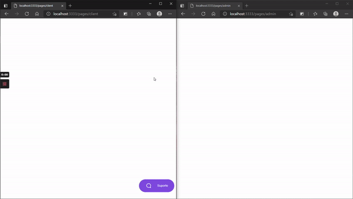

# Customer-Support-Backend

Neste repositorio está disponivel a apliacação desenvolvida durante a NLW #05 da RocketSeat, sendo um backend de sistema de atendimento ao cliente desenvolvido utilizando:

 * Node.js
 * Socket.io
 * Express

A aplicação conta com:

 * Log de mensagens enviadas; 
 * Pagina para os atendentes onde são exibidos os usuarios que não receberam atendimento até o momento.

